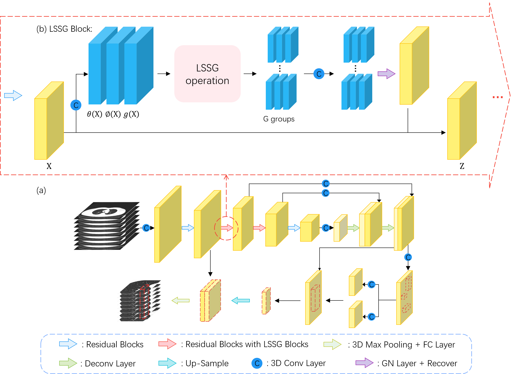

## LSSANet

This repository includes codes, models, and test results for our paper: "[_LSSANet: A Long Short Slice-Aware Network for 
Pulmonary Nodule Detection_](https://arxiv.org/abs/2208.02122)", __MICCAI 2022__ (Early Accept).
This project is licensed for non-commerical research purpose only.

### Method



### Results and Models

|Method          | 0.125  | 0.25   | 0.5    | 1.0    | 2.0    | 4.0    | 8.0    | Avg    | Pre-trained Model   |
|--------------- | ------ | ------ | ------ | ------ | ------ | ------ | ------ | ------ |-------------------- |
LSSANet          | 51.59  | 51.59  | 58.18  | 66.88  | 77.33  | 85.35  | 89.87  | 68.69  | [model](https://drive.google.com/file/d/1DOXO_8d2sSdtoKNo94uieFMyQLdQuiUx/view?usp=share_link) & [res](https://drive.google.com/drive/folders/19XgE6f31Y4jZ7t7RDhvhe4GDuvxA7IdT?usp=sharing) |

### Requirements

The code is built with the following libraries:

- Python 3.6 or higher
- CUDA 10.0 or higher
- [PyTorch](https://pytorch.org/) 1.2 or higher
- [tqdm](https://github.com/tqdm/tqdm.git)
- [scipy](https://www.scipy.org/)

Besides, you need to install a custom module for bounding box NMS and overlap calculation.
```
cd build/box
python setup.py install
```

### Data

Please refer to [PN9](https://jiemei.xyz/publications/SANet) for data preparation and then add the data information to 
`single_config.py`.

### Testing

Run the following scripts to evaluate the model and obtain the results of FROC analysis.
```
python single_test.py --ckpt='./results/model/model.ckpt' --out_dir='./results/'
```

### Training
This implementation supports multi-gpu, `data_parallel` training.

Change training configuration and data configuration in `single_config.py`, especially the path to preprocessed data.

Run the training script:
```
python single_train.py
```

### Citations

If you are using the code/model/data provided here in a publication, please consider citing:

    @inproceedings{DBLP:conf/miccai/XuLDKY22,
    author    = {Rui Xu and Yong Luo and Bo Du and Kaiming Kuang and Jiancheng Yang},
    editor    = {Linwei Wang and Qi Dou and P. Thomas Fletcher and Stefanie Speidel and Shuo Li},
    title     = {LSSANet: {A} Long Short Slice-Aware Network for Pulmonary Nodule Detection},
    booktitle = {MICCAI 2022},
    series    = {LNCS},
    volume    = {13431},
    pages     = {664--674},
    publisher = {Springer, Cham},
    year      = {2022},
    doi       = {10.1007/978-3-031-16431-6\_63}
    }

### Contact

For any questions, please contact: rui.xu AT whu.edu.cn.

### Acknowledgment

This code is based on the [SANet](https://github.com/mj129/SANet) and [NoduleNet](https://github.com/uci-cbcl/NoduleNet).
